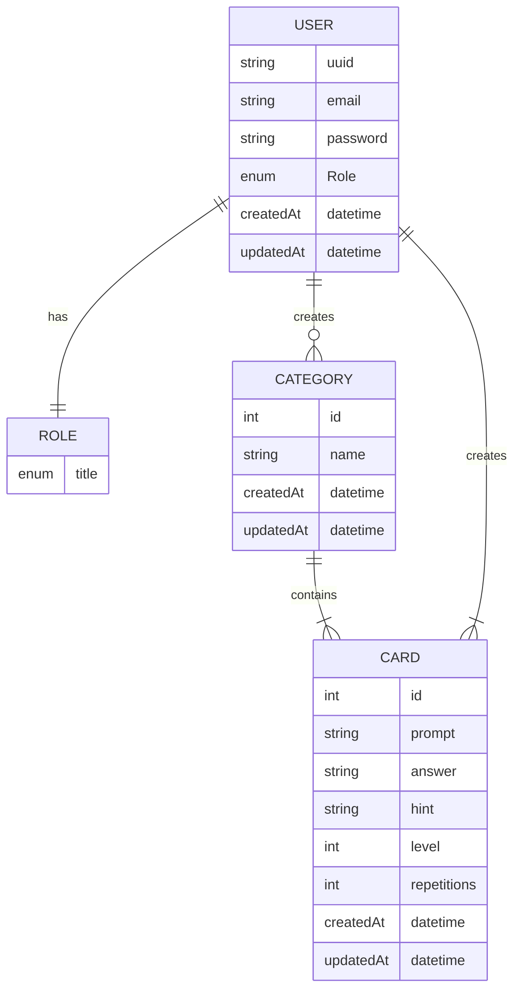

```mermaid
erDiagram
    USER {
        string uuid
        string email
        string password
        enum Role
        createdAt datetime
        updatedAt datetime
    }

    ROLE {
        enum title
    }
    CATEGORY {
        int id
        string name
        createdAt datetime
        updatedAt datetime
    }

    CARD {
        int id
        string prompt
        string answer
        string hint
        int level
        int repetitions
        createdAt datetime
        updatedAt datetime
    }

    USER ||--|| ROLE: has
    USER ||--o{ CATEGORY : creates
    CATEGORY ||--|{ CARD : contains
    USER ||--|{ CARD : creates
```
