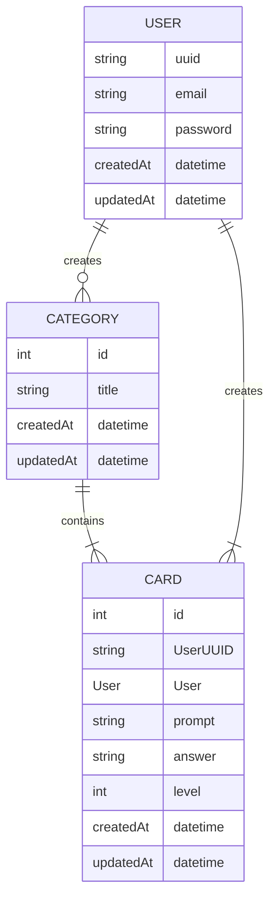

```mermaid
erDiagram
    USER {
        string uuid
        string email
        string password
        createdAt datetime
        updatedAt datetime
    }

    CATEGORY {
        int id
        string title
        createdAt datetime
        updatedAt datetime
    }

    CARD {
        int id
        string  UserUUID
        User  User
        string prompt
        string answer
        int level
        createdAt datetime
        updatedAt datetime
    }

    USER ||--o{ CATEGORY : creates
    CATEGORY ||--|{ CARD : contains
    USER ||--|{ CARD : creates
```
